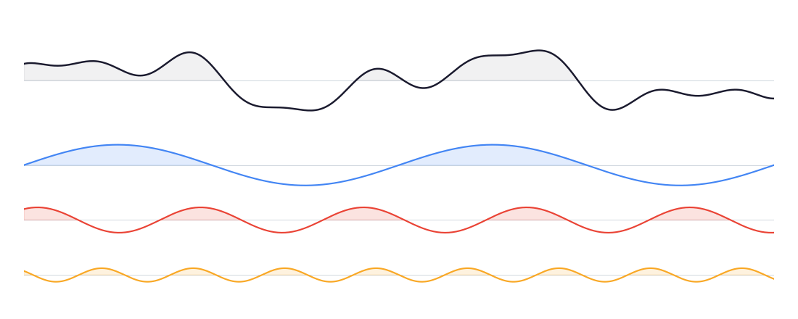

# Spectral



A quantitative research library that extends **Polars** DataFrames with charting and financial analytics.

## Modules

- **`spectral.charts`** — Fluent Bokeh visualization via `df.bokeh.line(...)`, `df.bokeh.scatter(...)`, etc.
- **`spectral.quant`** — Financial metrics (returns, volatility, beta) via `pl.col(...).quant.returns()`
- **`spectral.data`** — Market data from the Polygon/Massive API with caching and rate limiting

## Usage

```python
import polars as pl
import spectral  # registers .bokeh and .quant accessors

df = pl.DataFrame({"x": [1, 2, 3], "y": [4, 5, 6]})
fig = df.bokeh.line(x="x", y="y")
```

## Install

```bash
uv sync
```
